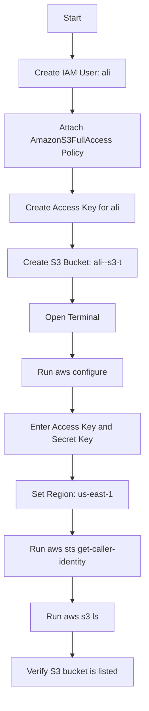

# README – Day 1 AWS Mini Project: IAM User, AWS CLI, and S3

## Overview

This project is a beginner-friendly AWS Day 1 hands-on lab.

In this project, an IAM user named `ali` is created from the AWS Console. An S3 bucket named `ali--s3-t` is also created from the AWS Console. Then AWS CLI is configured using the IAM user access key, and the S3 bucket is listed from the command line using `aws s3 ls`.

This project helps explain how IAM, AWS CLI, and Amazon S3 work together.

---

## Project Goal

The goal of this project is to understand:

```text
IAM User + Permissions + Access Key + AWS CLI + S3 Bucket
```

---

## Architecture

```text
Local PC / EC2 Terminal
        |
        | AWS CLI configured with IAM user ali
        |
        v
IAM User: ali
        |
        | AmazonS3FullAccess policy
        |
        v
S3 Bucket: ali--s3-t
```

---

## Mermaid Flowchart



---

## Services Used

| Service | Purpose |
|---|---|
| IAM | Create user and manage permissions |
| AWS CLI | Access AWS services from terminal |
| Amazon S3 | Create and list cloud storage bucket |
| STS | Verify the active AWS identity |

---

## Prerequisites

Before starting this project, make sure you have:

- AWS account
- AWS CLI installed
- IAM permissions to create users and policies
- Terminal access from local machine or EC2
- Basic understanding of IAM and S3

---

## Steps

### Step 1: Create IAM User

Create an IAM user named:

```text
ali
```

Path:

```text
AWS Console → IAM → Users → Create user
```

---

### Step 2: Attach S3 Permission

Attach this AWS managed policy:

```text
AmazonS3FullAccess
```

This allows the user to work with S3 for beginner lab practice.

---

### Step 3: Create S3 Bucket

Create an S3 bucket named:

```text
ali--s3-t
```

Recommended region:

```text
us-east-1
```

Note: S3 bucket names must be globally unique. If the name is already taken, use a unique name.

---

### Step 4: Create Access Key

Go to:

```text
IAM → Users → ali → Security credentials → Create access key
```

Choose:

```text
Command Line Interface CLI
```

Save the Access Key ID and Secret Access Key securely.

---

### Step 5: Configure AWS CLI

Run:

```bash
aws configure
```

Enter:

```text
AWS Access Key ID
AWS Secret Access Key
Default region name: us-east-1
Default output format: json
```

---

### Step 6: Verify IAM User

Run:

```bash
aws sts get-caller-identity
```

Expected result should show:

```text
arn:aws:iam::<account-id>:user/ali
```

---

### Step 7: List S3 Buckets

Run:

```bash
aws s3 ls
```

Expected result should show the bucket:

```text
ali--s3-t
```

---

## Useful Commands

```bash
aws configure
aws sts get-caller-identity
aws s3 ls
aws s3 ls s3://ali--s3-t
```

Optional upload/download practice:

```bash
echo "Hello from AWS Day 1 project" > day1.txt
aws s3 cp day1.txt s3://ali--s3-t/
aws s3 ls s3://ali--s3-t
aws s3 cp s3://ali--s3-t/day1.txt downloaded-day1.txt
cat downloaded-day1.txt
```

---

## Common Errors and Fixes

| Error | Reason | Fix |
|---|---|---|
| `Unable to locate credentials` | AWS CLI is not configured | Run `aws configure` |
| `AccessDenied` | IAM user does not have S3 permission | Attach correct S3 policy |
| `InvalidAccessKeyId` | Wrong access key | Recreate key and configure again |
| `SignatureDoesNotMatch` | Wrong secret key | Re-enter credentials carefully |
| Bucket name already exists | S3 bucket name is not globally unique | Use another unique name |
| Empty output from bucket list | Bucket has no files | Upload a test file |

---

## Security Notes

Never share:

```text
Access Key ID
Secret Access Key
```

Do not upload credentials to GitHub.

If an access key is exposed:

1. Go to IAM.
2. Open the user.
3. Go to Security credentials.
4. Deactivate/delete the exposed key.
5. Create a new key only if needed.

---

## Cleanup

To remove the test file:

```bash
aws s3 rm s3://ali--s3-t/day1.txt
```

To remove the bucket:

```bash
aws s3 rb s3://ali--s3-t
```

If the bucket contains files:

```bash
aws s3 rb s3://ali--s3-t --force
```

To remove local files:

```bash
rm -f day1.txt downloaded-day1.txt
```

---

## Learning Outcome

After completing this project, I understand:

- How to create an IAM user
- How to attach S3 permissions
- How to create an access key
- How to configure AWS CLI
- How to verify the active AWS identity
- How to list S3 buckets from CLI
- How IAM permissions control access to AWS services

---

## Final Summary

This Day 1 AWS mini project connects IAM, AWS CLI, and S3 in a simple hands-on workflow.

```text
IAM controls identity.
Policies control permission.
Access keys allow CLI access.
AWS CLI sends commands to AWS.
S3 stores files and objects in the cloud.
```

Alhamdulillah, this project is a strong beginner-level AWS practical task.
