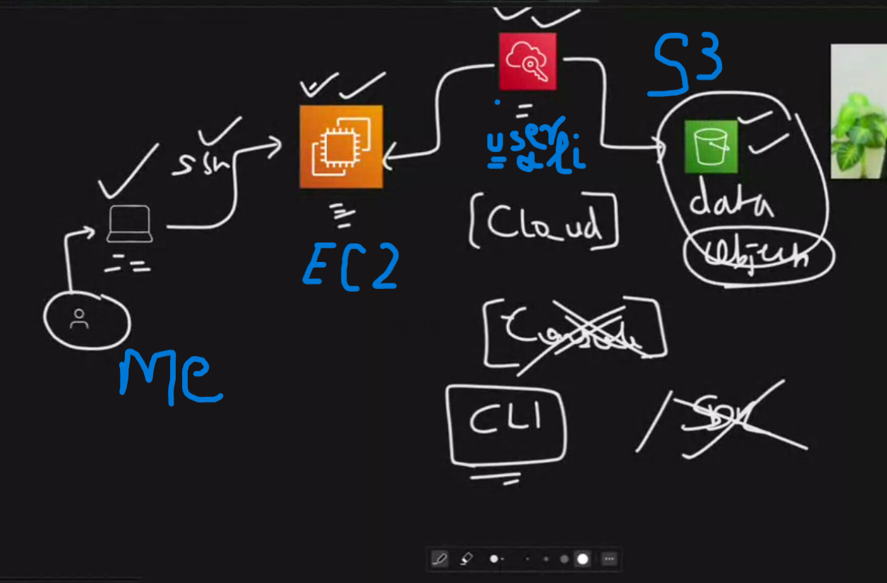
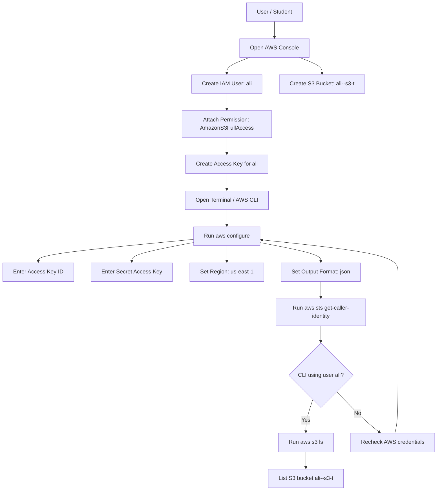
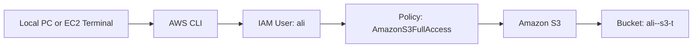

# Day 1 AWS Mini Project – IAM User, AWS CLI, and S3 Bucket




<video src="../../videos/d1-t1-s3-create-with-folder-files.mp4" controls width="700"></video>


## Project Overview

In this Day 1 AWS mini project, I practiced how an IAM user, AWS CLI, and Amazon S3 work together.

The project idea:

```text
Create IAM user ali
Create S3 bucket ali--s3-t from AWS Console
Create access key for IAM user ali
Configure AWS CLI using ali credentials
Run aws s3 ls from CLI to list S3 buckets
```

This project is useful because it connects three important AWS basics:

- IAM user
- AWS CLI
- Amazon S3

---

## Project Objective

By the end of this project, I should be able to:

1. Create an IAM user from AWS Console.
2. Attach S3 permission to the IAM user.
3. Create an S3 bucket from AWS Console.
4. Create an access key for CLI access.
5. Configure AWS CLI using `aws configure`.
6. Verify CLI identity using `aws sts get-caller-identity`.
7. List S3 buckets using `aws s3 ls`.
8. Understand how IAM permissions control access to AWS services.

---

## Simple Project Architecture

```text
My PC / EC2 Terminal
        |
        | AWS CLI configured with ali access key
        |
        v
IAM User: ali
        |
        | Permission: AmazonS3FullAccess
        |
        v
Amazon S3 Bucket: ali--s3-t
```

---

## Mermaid Flowchart



---

## Mermaid Architecture Diagram



---

# Step-by-Step Project Guide

## Step 1 – Create IAM User `ali`

Go to:

```text
AWS Console → IAM → Users → Create user
```

User name:

```text
ali
```

For this CLI project, console access is not required unless the task specifically asks for it.

---

## Step 2 – Attach S3 Permission

For Day 1 beginner practice, attach this AWS managed policy:

```text
AmazonS3FullAccess
```

This policy allows the IAM user to:

- List S3 buckets
- Create S3 buckets
- Upload files
- Download files
- Delete S3 objects and buckets

### Important Security Note

For beginner lab practice, `AmazonS3FullAccess` is okay.

For real company work, use the **least privilege principle**, which means giving only the permissions that are required.

---

## Step 3 – Create S3 Bucket from Console

Go to:

```text
AWS Console → S3 → Create bucket
```

Bucket name:

```text
ali--s3-t
```

Region:

```text
us-east-1
```

Then click:

```text
Create bucket
```

### Important S3 Bucket Name Note

S3 bucket names must be globally unique.

If this bucket name is already taken, use a unique name like:

```text
ali-s3-t-278635088909
```

or:

```text
ali-s3-t-day1-practice
```

---

## Step 4 – Create Access Key for IAM User `ali`

Go to:

```text
IAM → Users → ali → Security credentials → Create access key
```

Choose use case:

```text
Command Line Interface CLI
```

AWS will generate:

```text
Access Key ID
Secret Access Key
```

### Very Important Security Note

Never share:

```text
Access Key ID
Secret Access Key
```

Especially never share the **Secret Access Key** in screenshots, chats, GitHub, or notes.

If a key is exposed, delete it and create a new key.

---

## Step 5 – Configure AWS CLI

Run this command in terminal:

```bash
aws configure
```

Enter the values:

```text
AWS Access Key ID: paste ali access key
AWS Secret Access Key: paste ali secret access key
Default region name: us-east-1
Default output format: json
```

---

## Step 6 – Verify CLI Identity

Run:

```bash
aws sts get-caller-identity
```

Expected output should show IAM user `ali`:

```json
{
  "UserId": "EXAMPLEUSERID",
  "Account": "278635088909",
  "Arn": "arn:aws:iam::278635088909:user/ali"
}
```

This confirms that AWS CLI is using the IAM user `ali`.

---

## Step 7 – List S3 Buckets

Run:

```bash
aws s3 ls
```

Expected output:

```text
2026-07-04  ali--s3-t
```

This means the CLI can successfully access S3 and list buckets.

---

## Step 8 – List Inside Specific Bucket

Run:

```bash
aws s3 ls s3://ali--s3-t
```

If the bucket is empty, no files will appear. This is normal.

---

## Step 9 – Upload a Test File to S3

Create a test file:

```bash
echo "Hello from AWS Day 1 project" > day1.txt
```

Upload it to S3:

```bash
aws s3 cp day1.txt s3://ali--s3-t/
```

List the bucket:

```bash
aws s3 ls s3://ali--s3-t
```

Expected output should show:

```text
day1.txt
```

---

## Step 10 – Download the Test File from S3

Download the file:

```bash
aws s3 cp s3://ali--s3-t/day1.txt downloaded-day1.txt
```

Read the file:

```bash
cat downloaded-day1.txt
```

Expected output:

```text
Hello from AWS Day 1 project
```

---

# Important Commands Summary

```bash
aws configure
aws sts get-caller-identity
aws s3 ls
aws s3 ls s3://ali--s3-t
echo "Hello from AWS Day 1 project" > day1.txt
aws s3 cp day1.txt s3://ali--s3-t/
aws s3 ls s3://ali--s3-t
aws s3 cp s3://ali--s3-t/day1.txt downloaded-day1.txt
cat downloaded-day1.txt
```

---

# Common Errors and Fixes

| Error | Reason | Fix |
|---|---|---|
| `Unable to locate credentials` | AWS CLI is not configured | Run `aws configure` |
| `AccessDenied` | IAM user does not have S3 permission | Attach `AmazonS3FullAccess` or correct S3 policy |
| `InvalidAccessKeyId` | Wrong access key was entered | Recreate access key and configure again |
| `SignatureDoesNotMatch` | Secret key is wrong | Run `aws configure` again carefully |
| Bucket name already exists | S3 bucket names are globally unique | Use a unique bucket name |
| Empty output from `aws s3 ls s3://bucket-name` | Bucket has no files | Upload a test file |
| `An error occurred (NoSuchBucket)` | Bucket name is wrong or bucket does not exist | Check bucket name in S3 Console |

---

# Key Concepts Learned

## IAM User

An IAM user is an identity in AWS that can be given permissions to access AWS services.

Example:

```text
ali
```

## Access Key

An access key allows an IAM user to access AWS from the command line or programmatically.

It has two parts:

```text
Access Key ID
Secret Access Key
```

## AWS CLI

AWS CLI is a command-line tool used to manage AWS services from the terminal.

Example:

```bash
aws s3 ls
```

## Amazon S3

Amazon S3 is object storage in AWS. It can store files, backups, images, videos, logs, documents, and static website files.

## IAM Policy

An IAM policy defines what actions a user can perform.

Example:

```text
AmazonS3FullAccess
```

---

# What This Project Proves

This project proves that:

1. IAM user `ali` exists.
2. User `ali` has S3 permissions.
3. AWS CLI is configured with `ali` credentials.
4. CLI can authenticate to AWS.
5. CLI can list S3 buckets.
6. CLI can upload and download files from S3.

---

# Project Explanation for Interview or LinkedIn

```text
In this Day 1 AWS mini project, I created an IAM user named ali and attached S3 permissions to it. Then I created an S3 bucket named ali--s3-t from the AWS Console. After that, I generated an access key for the IAM user and configured AWS CLI using aws configure. Finally, I verified the identity with aws sts get-caller-identity and listed S3 buckets using aws s3 ls.

This project helped me understand how IAM users, access keys, AWS CLI, and Amazon S3 work together in AWS.
```

---

# Cleanup Steps

After practice, to avoid unwanted charges and improve security:

## Delete test files from S3

```bash
aws s3 rm s3://ali--s3-t/day1.txt
```

## Delete local downloaded file

```bash
rm -f day1.txt downloaded-day1.txt
```

## Optional: Delete S3 bucket if no longer needed

```bash
aws s3 rb s3://ali--s3-t
```

If the bucket has files, use:

```bash
aws s3 rb s3://ali--s3-t --force
```

## Security cleanup

If the access key was exposed anywhere:

```text
IAM → Users → ali → Security credentials → Access keys → Deactivate/Delete exposed key
```

Then create a new key only if needed.

---

# Final Summary

In this Day 1 project, I practiced the basic AWS workflow of creating an IAM user, giving permissions, configuring AWS CLI, and accessing S3 from the command line.

This project is a strong beginner-level AWS hands-on task because it connects identity, permissions, CLI authentication, and cloud storage.

```text
IAM controls who can access AWS.
Policies control what the user can do.
AWS CLI allows terminal-based access.
S3 stores files and objects in the cloud.
```

Alhamdulillah, this project helped me understand AWS Day 1 basics more clearly.
