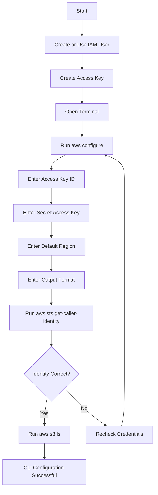
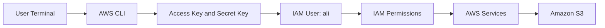

# Day 1 AWS Practice – Configure AWS CLI

https://youtu.be/XvnQ6WOMBBw


<video src="../videos/d1-t1-aws-configure.mp4" controls width="700"></video>


## Overview

In this practice, I configured AWS CLI using an IAM user access key.

AWS CLI stands for:

```text
Amazon Web Services Command Line Interface
```

AWS CLI allows users to manage AWS services from the terminal instead of using only the AWS Console.

This practice is important because many DevOps and cloud tasks are done from the command line.

---

## Practice Objective

By completing this practice, I should be able to:

1. Understand what AWS CLI is.
2. Create or use an IAM user access key.
3. Configure AWS CLI using `aws configure`.
4. Set the default AWS region.
5. Set the default output format.
6. Verify the configured identity.
7. Test AWS CLI by listing S3 buckets.
8. Understand where AWS CLI stores credentials and configuration.

---

# What Is AWS CLI?

AWS CLI is a command-line tool used to interact with AWS services.

With AWS CLI, I can manage services like:

- EC2
- S3
- IAM
- VPC
- Lambda
- CloudWatch
- RDS

Example:

```bash
aws s3 ls
```

This command lists S3 buckets that the configured IAM user has permission to view.

---

# Why Configure AWS CLI?

AWS CLI needs credentials to know:

```text
Who is making the request?
Which AWS account is being used?
Which permissions are allowed?
Which region should be used by default?
```

Without configuration, AWS CLI may show an error like:

```text
Unable to locate credentials
```

---

# Required Information for AWS CLI Configuration

Before running `aws configure`, I need:

| Required Value | Meaning |
|---|---|
| AWS Access Key ID | Public part of the access key |
| AWS Secret Access Key | Private secret part of the access key |
| Default region name | AWS region used by default |
| Default output format | Output style such as json, table, or text |

Example values:

```text
Default region name: us-east-1
Default output format: json
```

---

# Step 1 – Open Terminal

On EC2 Ubuntu, the prompt may look like:

```bash
ubuntu@ip-172-31-0-70:~$
```

On Git Bash, the prompt may look like:

```bash
krmar@Khalid-laptop CLANGARM64 /c/Linux
$
```

---

# Step 2 – Run AWS Configure

## Command

```bash
aws configure
```

## What AWS CLI Asks

```text
AWS Access Key ID [None]:
AWS Secret Access Key [None]:
Default region name [None]:
Default output format [None]:
```

---

# Step 3 – Enter Access Key ID

Paste the IAM user access key ID.

Example format:

```text
AKIAxxxxxxxxxxxxxxxx
```

Important:

```text
Do not share your access key in screenshots, GitHub, or chat.
```

---

# Step 4 – Enter Secret Access Key

Paste the secret access key.

Important:

```text
The Secret Access Key is sensitive.
Never share it publicly.
If exposed, delete it and create a new key.
```

---

# Step 5 – Enter Default Region

Example:

```text
us-east-1
```

The region tells AWS CLI which AWS region to use by default.

Common examples:

| Region | Meaning |
|---|---|
| us-east-1 | N. Virginia |
| us-east-2 | Ohio |
| us-west-1 | N. California |
| us-west-2 | Oregon |

For beginner practice, `us-east-1` is commonly used.

---

# Step 6 – Enter Output Format

Recommended value:

```text
json
```

Other possible formats:

| Format | Meaning |
|---|---|
| json | Structured JSON output |
| table | Human-readable table |
| text | Plain text output |

For learning and automation, `json` is commonly used.

---

# Full AWS Configure Example

```bash
aws configure
```

Example input:

```text
AWS Access Key ID [None]: AKIAxxxxxxxxxxxxxxxx
AWS Secret Access Key [None]: xxxxxxxxxxxxxxxxxxxxxxxxxxxxxxxx
Default region name [None]: us-east-1
Default output format [None]: json
```

---

# Step 7 – Verify AWS CLI Identity

After configuration, run:

```bash
aws sts get-caller-identity
```

Expected output:

```json
{
    "UserId": "EXAMPLEUSERID",
    "Account": "123456789012",
    "Arn": "arn:aws:iam::123456789012:user/ali"
}
```

## Explanation

This command confirms which IAM user or role AWS CLI is using.

If the output shows:

```text
arn:aws:iam::<account-id>:user/ali
```

then AWS CLI is configured with IAM user `ali`.

---

# Step 8 – Test AWS CLI with S3

Run:

```bash
aws s3 ls
```

Expected output example:

```text
2026-07-04 23:04:22 ali-s3-t1
```

This confirms that AWS CLI can access S3 and list buckets.

---

# Important AWS CLI Files

When `aws configure` is completed, AWS CLI stores information in two files.

## Credentials File

Path:

```bash
~/.aws/credentials
```

This file stores:

```text
AWS Access Key ID
AWS Secret Access Key
```

Example:

```ini
[default]
aws_access_key_id = AKIAxxxxxxxxxxxxxxxx
aws_secret_access_key = xxxxxxxxxxxxxxxxxxxxxxxxxxxxxxxx
```

## Config File

Path:

```bash
~/.aws/config
```

This file stores:

```text
Default region
Output format
```

Example:

```ini
[default]
region = us-east-1
output = json
```

---

# Check AWS CLI Configuration Files

## View AWS directory

```bash
ls -la ~/.aws
```

## View config file

```bash
cat ~/.aws/config
```

## View credentials file

```bash
cat ~/.aws/credentials
```

Important:

```text
Do not show or share the credentials file publicly.
```

---

# Useful AWS CLI Commands

## Configure AWS CLI

```bash
aws configure
```

## Verify identity

```bash
aws sts get-caller-identity
```

## List S3 buckets

```bash
aws s3 ls
```

## List a specific bucket

```bash
aws s3 ls s3://bucket-name
```

## List bucket recursively

```bash
aws s3 ls s3://bucket-name --recursive
```

## Upload file to S3

```bash
aws s3 cp file.txt s3://bucket-name/
```

## Download file from S3

```bash
aws s3 cp s3://bucket-name/file.txt .
```

---

# Mermaid Flowchart



---

# AWS CLI Configuration Architecture



---

# Common Errors and Fixes

| Error | Reason | Fix |
|---|---|---|
| `Unable to locate credentials` | AWS CLI is not configured | Run `aws configure` |
| `InvalidAccessKeyId` | Access Key ID is wrong | Recreate access key and configure again |
| `SignatureDoesNotMatch` | Secret Access Key is wrong | Enter secret key carefully |
| `AccessDenied` | IAM user does not have permission | Attach correct IAM policy |
| `You must specify a region` | Region is missing | Set region using `aws configure` |
| Empty output from `aws s3 ls` | No buckets or no permission | Check S3 bucket and IAM permissions |

---

# Security Best Practices

## Never Share Credentials

Do not share:

```text
Access Key ID
Secret Access Key
~/.aws/credentials file
Screenshots showing keys
```

## Do Not Upload Credentials to GitHub

Never commit these files:

```text
~/.aws/credentials
~/.aws/config
.pem key files
.env files with secrets
```

## Rotate Exposed Keys

If an access key is exposed:

1. Go to IAM.
2. Open the user.
3. Go to Security credentials.
4. Deactivate the exposed key.
5. Delete the exposed key.
6. Create a new key only if needed.
7. Run `aws configure` again.

---

# Cleanup or Reconfigure AWS CLI

## Reconfigure default profile

```bash
aws configure
```

## Remove AWS CLI credentials manually

```bash
rm -rf ~/.aws
```

Only do this if you want to remove all local AWS CLI configuration.

---

# Important Notes

## AWS CLI Uses IAM Permissions

Even if AWS CLI is configured correctly, commands will only work if the IAM user has permission.

Example:

```text
If user ali has S3 permission, aws s3 ls will work.
If user ali does not have S3 permission, AccessDenied will appear.
```

## CLI Configuration Does Not Mean Admin Access

Configuring AWS CLI only authenticates the user.  
Authorization depends on IAM policies.

Simple difference:

```text
Authentication = Who are you?
Authorization = What are you allowed to do?
```

---

# Practice Summary

In this practice, I configured AWS CLI using IAM user credentials. I entered the Access Key ID, Secret Access Key, default region, and output format. Then I verified the identity using `aws sts get-caller-identity` and tested S3 access using `aws s3 ls`.

This helped me understand how AWS CLI connects my terminal to AWS services securely through IAM credentials.

---

# Final One-Line Summary

```text
AWS CLI configuration connects a terminal to AWS using IAM user credentials and allows AWS services to be managed from the command line.
```

Alhamdulillah, this practice helped me understand AWS CLI setup clearly.
