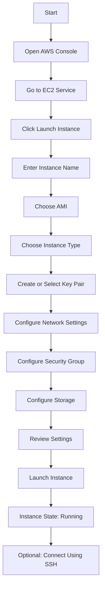
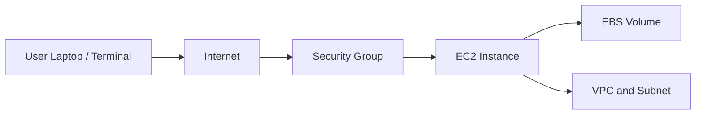

# Day 1 AWS Practice – Create EC2 Instance from AWS Console

<video src="../videos/d1-t1-ec2-create.mp4" controls width="700"></video>

## Overview

In this practice, I created an Amazon EC2 instance from the AWS Management Console.

This task helped me understand how to launch a virtual server in AWS and connect Day 1 AWS concepts with a real hands-on project.

Amazon EC2 stands for:

```text
Elastic Compute Cloud
```

EC2 is used to create and manage virtual servers in AWS.

---

## Practice Objective

By completing this practice, I should be able to:

1. Open the EC2 service from AWS Console.
2. Launch a new EC2 instance.
3. Choose an Amazon Machine Image, also called AMI.
4. Select an instance type.
5. Create or select a key pair.
6. Configure network settings and security group.
7. Launch the instance.
8. Verify that the EC2 instance is running.
9. Understand the basic purpose of EC2.

---

## What Is EC2?

Amazon EC2 is a compute service in AWS that provides virtual servers.

Simple meaning:

```text
EC2 = Virtual server in AWS
```

Instead of buying a physical server, we can create an EC2 instance in a few minutes.

Example:

```text
A DevOps engineer can launch an EC2 instance, install NGINX, and host a website.
```

---

## EC2 in Service Model

EC2 is an example of:

```text
IaaS = Infrastructure as a Service
```

Why?

Because AWS provides the virtual infrastructure, but the user manages the operating system, packages, applications, updates, and configuration.

---

# Step-by-Step EC2 Creation

## Step 1 – Open EC2 Service

Go to:

```text
AWS Console → Search EC2 → Open EC2
```

The EC2 dashboard shows information about instances, security groups, key pairs, volumes, and other compute resources.

---

## Step 2 – Click Launch Instance

From the EC2 dashboard, click:

```text
Launch instance
```

This starts the EC2 instance creation process.

---

## Step 3 – Enter Instance Name

Give the instance a name.

Example:

```text
day-1-ec2-practice
```

A name helps identify the instance easily in the console.

---

## Step 4 – Choose AMI

AMI stands for:

```text
Amazon Machine Image
```

An AMI is a template used to create an EC2 instance.

Common AMI examples:

| AMI | Meaning |
|---|---|
| Amazon Linux | AWS-managed Linux image |
| Ubuntu | Popular Linux operating system |
| Red Hat Enterprise Linux | Enterprise Linux distribution |
| Windows Server | Windows-based server OS |

For beginner AWS practice, Ubuntu or Amazon Linux is commonly used.

---

## Step 5 – Choose Instance Type

Instance type defines the CPU, memory, and network capacity of the EC2 instance.

For beginner practice, select:

```text
t2.micro
```

or:

```text
t3.micro
```

These are commonly used for Free Tier practice, depending on account and region availability.

---

## Step 6 – Create or Select Key Pair

A key pair is used to connect to the EC2 instance securely using SSH.

Key pair includes:

```text
Public key stored in AWS
Private key downloaded by user
```

Example key file:

```text
day1-key.pem
```

Important:

```text
Keep the private key safe.
Do not share it.
Do not upload it to GitHub.
```

---

## Step 7 – Configure Network Settings

Network settings decide how the EC2 instance connects to the internet and other AWS resources.

Important options:

| Setting | Meaning |
|---|---|
| VPC | Virtual network in AWS |
| Subnet | Smaller network inside VPC |
| Auto-assign public IP | Gives public IP for internet access |
| Security Group | Firewall rules for the instance |

---

## Step 8 – Configure Security Group

A security group works like a virtual firewall.

For SSH access to Linux instance, allow:

```text
Type: SSH
Port: 22
Source: My IP
```

For web server practice, allow:

```text
HTTP  port 80
HTTPS port 443
```

For security, avoid opening SSH to everyone unless it is only for temporary lab practice.

Better option:

```text
SSH source = My IP
```

---

## Step 9 – Configure Storage

Default root volume is usually enough for beginner practice.

Example:

```text
8 GiB gp3
```

Storage is used to hold the operating system and files.

---

## Step 10 – Review and Launch

Review all settings:

```text
Instance name
AMI
Instance type
Key pair
Security group
Storage
Network
```

Then click:

```text
Launch instance
```

---

## Step 11 – Verify Instance State

After launching, go to:

```text
EC2 → Instances
```

Check instance state:

```text
Running
```

Also check status checks:

```text
2/2 checks passed
```

This means the instance is healthy and ready.

---

# Optional: Connect to EC2 Using SSH

If using Ubuntu, SSH command format:

```bash
ssh -i key-name.pem ubuntu@public-ip
```

Example:

```bash
ssh -i day1-key.pem ubuntu@13.58.100.25
```

If using Amazon Linux:

```bash
ssh -i key-name.pem ec2-user@public-ip
```

Important private key permission command:

```bash
chmod 400 key-name.pem
```

---

# Important EC2 Terms

| Term | Meaning |
|---|---|
| EC2 | Virtual server in AWS |
| Instance | One running virtual server |
| AMI | Template/image used to create instance |
| Instance Type | CPU and memory size |
| Key Pair | Used for secure SSH login |
| Security Group | Virtual firewall |
| VPC | Virtual private cloud network |
| Subnet | Smaller network inside VPC |
| Public IP | Internet-facing IP address |
| EBS Volume | Storage attached to EC2 |

---

# Mermaid Flowchart



---

# EC2 Architecture Diagram



---

# Useful Commands

## SSH to Ubuntu EC2

```bash
ssh -i key-name.pem ubuntu@public-ip
```

## SSH to Amazon Linux EC2

```bash
ssh -i key-name.pem ec2-user@public-ip
```

## Fix Private Key Permission

```bash
chmod 400 key-name.pem
```

## Check Current User After Login

```bash
whoami
```

## Check Hostname

```bash
hostname
```

## Check OS Information

```bash
cat /etc/os-release
```

---

# Common Errors and Fixes

| Error | Reason | Fix |
|---|---|---|
| Permission denied publickey | Wrong key or wrong username | Use correct key and username |
| Bad permissions on key file | Private key is too open | Run `chmod 400 key-name.pem` |
| Connection timed out | Security group does not allow SSH | Allow port 22 from your IP |
| Could not resolve hostname | Wrong public IP or command format | Check public IP and SSH command |
| Instance not reachable | Instance may not have public IP | Enable public IP or use proper subnet |
| 2/2 checks not passed | Instance still initializing or issue exists | Wait or troubleshoot instance |

---

# Security Best Practices

For beginner labs:

```text
Use My IP for SSH
Do not share private key
Do not upload .pem file to GitHub
Stop or terminate unused instances
Monitor billing
```

For real company work:

```text
Use least privilege
Use IAM roles where possible
Avoid opening SSH to 0.0.0.0/0
Use Session Manager instead of SSH when possible
Apply patching and monitoring
```

---

# Cleanup Steps

To avoid unwanted charges:

1. Go to EC2 Console.
2. Select the instance.
3. Click Instance state.
4. Choose Stop or Terminate.

Difference:

| Action | Meaning |
|---|---|
| Stop | Instance shuts down but can be started again |
| Terminate | Instance is deleted permanently |

For practice cleanup, if the instance is no longer needed:

```text
Terminate the instance
```

Also check and delete unused:

```text
EBS volumes
Elastic IPs
Snapshots
```

---

# Practice Summary

In this practice, I created an EC2 instance from the AWS Console.

I learned that EC2 is a virtual server in AWS and is part of IaaS. I practiced selecting an AMI, choosing an instance type, configuring a key pair, setting up network/security group rules, and launching the instance.

This helped me understand how cloud servers are created without buying physical hardware.

---

# Final One-Line Summary

```text
Amazon EC2 allows users to create virtual servers in AWS within minutes without buying physical hardware.
```

Alhamdulillah, this Day 1 EC2 creation practice helped me understand AWS compute basics.
