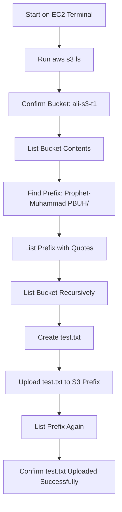
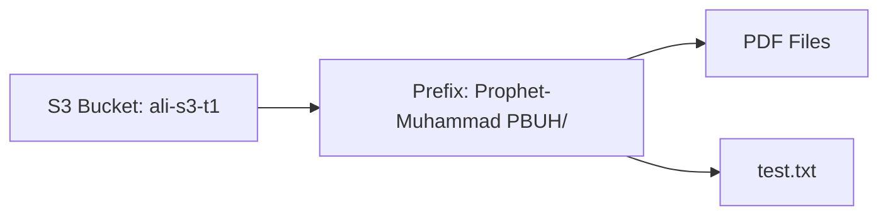

# Day 1 AWS S3 CLI Practice – Bucket Access and File Upload

<video src="../videos/d1-t1-s3-create-with-folder-files.mp4" controls width="700"></video>

https://youtu.be/0Bh2YaZA_YA

## Overview

In this practice, I used AWS CLI from an EC2 Ubuntu terminal to access an S3 bucket, list folders/files, and upload a test file to a specific S3 prefix/folder.

This practice helped me understand how to:

- List S3 buckets from CLI
- List contents inside a bucket
- List contents inside an S3 folder/prefix
- Use quotes for S3 paths that contain spaces
- Use `--recursive` to list all objects
- Upload a file from EC2 to S3 using `aws s3 cp`

---

## Environment

```text
User/Host: ubuntu@ip-172-31-0-70
AWS Service: Amazon S3
Bucket Name: ali-s3-t1
S3 Folder/Prefix: Prophet-Muhammad PBUH/
Local Test File: test.txt
```

---

# Step 1 – List All S3 Buckets

## Command

```bash
aws s3 ls
```

## Output

```text
2026-07-04 23:04:22 ali-s3-t1
```

## Explanation

This command lists all S3 buckets that the configured AWS CLI user has permission to view.

The output shows that the bucket `ali-s3-t1` exists.

---

# Step 2 – List Contents of the S3 Bucket

## Command

```bash
aws s3 ls s3://ali-s3-t1
```

## Output

```text
                           PRE Prophet-Muhammad PBUH/
```

## Explanation

This command lists the top-level contents of the bucket.

The output shows:

```text
PRE Prophet-Muhammad PBUH/
```

In S3, `PRE` means **prefix**. It looks like a folder, but technically S3 uses object keys and prefixes, not real Linux-style folders.

---

# Step 3 – List Contents Inside the S3 Prefix

## Command

```bash
aws s3 ls "s3://ali-s3-t1/Prophet-Muhammad PBUH/"
```

## Output

```text
2026-07-04 23:04:58          0
2026-07-04 23:05:47    1751234 1 عصمت انبیاء  علیہم السلام.pdf
2026-07-04 23:05:47    7862788 حیات النبی صلی اللہ علیہ وسلم.pdf
2026-07-04 23:05:48     589894 رسول اللہ کی حکیمانہ نصیحتیں 280.pdf
2026-07-04 23:05:48    4237697 زبدة الشمائل- مولانا الیاس گھمن حفظہ اللہ.pdf
2026-07-04 23:05:48    4557901 صلاۃ وسلام- متکلم اسلام حفظہ اللہ.pdf
```

## Explanation

Because the S3 prefix name contains spaces:

```text
Prophet-Muhammad PBUH/
```

the S3 path must be wrapped in quotes:

```bash
"s3://ali-s3-t1/Prophet-Muhammad PBUH/"
```

If quotes are not used, the shell will split the path into multiple parts and the AWS CLI command may fail.

---

# Step 4 – List Bucket Contents Recursively

## Command

```bash
aws s3 ls s3://ali-s3-t1 --recursive
```

## Output

```text
2026-07-04 23:04:58          0 Prophet-Muhammad PBUH/
2026-07-04 23:05:47    1751234 Prophet-Muhammad PBUH/1 عصمت انبیاء  علیہم السلام.pdf
2026-07-04 23:05:47    7862788 Prophet-Muhammad PBUH/حیات النبی صلی اللہ علیہ وسلم.pdf
2026-07-04 23:05:48     589894 Prophet-Muhammad PBUH/رسول اللہ کی حکیمانہ نصیحتیں 280.pdf
2026-07-04 23:05:48    4237697 Prophet-Muhammad PBUH/زبدة الشمائل- مولانا الیاس گھمن حفظہ اللہ.pdf
2026-07-04 23:05:48    4557901 Prophet-Muhammad PBUH/صلاۃ وسلام- متکلم اسلام حفظہ اللہ.pdf
```

## Explanation

The `--recursive` option lists all objects inside the bucket and all prefixes.

Without `--recursive`, AWS CLI shows only the top-level prefix/folder.  
With `--recursive`, AWS CLI shows the full object paths.

---

# Step 5 – Create a Local Test File on EC2

## Command

```bash
echo "Test from EC2 CLI" > test.txt
```

## Explanation

This command creates a local file named `test.txt` in the current EC2 user home directory.

The file contains:

```text
Test from EC2 CLI
```

---

# Step 6 – Upload the Test File to S3

## Command

```bash
aws s3 cp test.txt "s3://ali-s3-t1/Prophet-Muhammad PBUH/"
```

## Output

```text
upload: ./test.txt to s3://ali-s3-t1/Prophet-Muhammad PBUH/test.txt
```

## Explanation

This command uploads the local file `test.txt` into the S3 prefix:

```text
Prophet-Muhammad PBUH/
```

The uploaded file path becomes:

```text
s3://ali-s3-t1/Prophet-Muhammad PBUH/test.txt
```

---

# Step 7 – Verify the Uploaded File

## Command

```bash
aws s3 ls "s3://ali-s3-t1/Prophet-Muhammad PBUH/"
```

## Output

```text
2026-07-04 23:04:58          0
2026-07-04 23:05:47    1751234 1 عصمت انبیاء  علیہم السلام.pdf
2026-07-04 23:53:06         18 test.txt
2026-07-04 23:05:47    7862788 حیات النبی صلی اللہ علیہ وسلم.pdf
2026-07-04 23:05:48     589894 رسول اللہ کی حکیمانہ نصیحتیں 280.pdf
2026-07-04 23:05:48    4237697 زبدة الشمائل- مولانا الیاس گھمن حفظہ اللہ.pdf
2026-07-04 23:05:48    4557901 صلاۃ وسلام- متکلم اسلام حفظہ اللہ.pdf
```

## Explanation

The output confirms that `test.txt` was uploaded successfully.

The file size is:

```text
18 bytes
```

This matches the content:

```text
Test from EC2 CLI
```

---

# Important Commands Used

```bash
aws s3 ls
aws s3 ls s3://ali-s3-t1
aws s3 ls "s3://ali-s3-t1/Prophet-Muhammad PBUH/"
aws s3 ls s3://ali-s3-t1 --recursive
echo "Test from EC2 CLI" > test.txt
aws s3 cp test.txt "s3://ali-s3-t1/Prophet-Muhammad PBUH/"
```

---

# Important Concepts Learned

## 1. S3 Bucket

An S3 bucket is a container used to store objects/files in Amazon S3.

Example:

```text
ali-s3-t1
```

---

## 2. S3 Prefix

S3 does not use real folders like Linux. It uses prefixes in object names.

Example:

```text
Prophet-Muhammad PBUH/
```

This appears like a folder in the AWS Console and CLI.

---

## 3. PRE in AWS CLI Output

When AWS CLI shows:

```text
PRE Prophet-Muhammad PBUH/
```

it means there is an S3 prefix that looks like a folder.

---

## 4. Quotes Around S3 Paths

If the S3 path contains spaces, use quotes.

Correct:

```bash
aws s3 ls "s3://ali-s3-t1/Prophet-Muhammad PBUH/"
```

Wrong:

```bash
aws s3 ls s3://ali-s3-t1/Prophet-Muhammad PBUH/
```

Without quotes, the shell treats spaces as separators.

---

## 5. Recursive Listing

The `--recursive` option shows all files inside the bucket and its prefixes.

```bash
aws s3 ls s3://ali-s3-t1 --recursive
```

---

## 6. Upload File to S3

The `aws s3 cp` command copies files between local system and S3.

Upload example:

```bash
aws s3 cp test.txt "s3://ali-s3-t1/Prophet-Muhammad PBUH/"
```

---

# Common Mistakes and Fixes

| Mistake/Error | Reason | Fix |
|---|---|---|
| Command fails when folder has spaces | S3 path was not quoted | Use quotes around the full S3 path |
| `PRE` is confusing | S3 uses prefixes instead of real folders | Understand `PRE` as an S3 folder-like prefix |
| No output after listing a bucket | Bucket or prefix may be empty | Upload a file and list again |
| `AccessDenied` | IAM user does not have S3 permission | Attach correct S3 policy |
| `NoSuchBucket` | Bucket name is wrong | Verify bucket name carefully |
| File not showing after upload | Wrong prefix/path used | List with `--recursive` |

---

# Project Flow



---

# S3 Path Structure



---

# Final Verification

The uploaded file was confirmed in S3:

```text
2026-07-04 23:53:06         18 test.txt
```

This proves that:

1. AWS CLI is configured correctly.
2. The IAM user has S3 access.
3. The bucket exists.
4. The S3 prefix exists.
5. EC2 can upload files to S3 using AWS CLI.

---

# Final Summary

In this practice, I used AWS CLI from an EC2 Ubuntu terminal to list an S3 bucket, view a prefix/folder, list files recursively, create a local test file, upload it to S3, and verify the upload.

The most important learning was that S3 folders are actually prefixes, and if a path contains spaces, the full S3 path must be wrapped in quotes.

```text
S3 bucket = storage container
S3 prefix = folder-like path
aws s3 ls = list buckets or objects
aws s3 cp = copy/upload/download files
--recursive = show all objects inside bucket/prefix
```

Alhamdulillah, this practice successfully confirmed S3 bucket access from AWS CLI.
